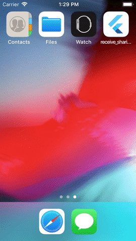

# receive_sharing_intent

A flutter plugin that enables flutter apps to receive sharing photos, videos, text, urls or any other file types from another app.

Also, supports iOS Share extension and launching the host app automatically. 
Check the provided example for more info.




# Usage

## Android

android/app/src/main/manifest.xml
```xml
<manifest xmlns:android="http://schemas.android.com/apk/res/android"
.....
 <uses-permission android:name="android.permission.READ_EXTERNAL_STORAGE"/>

  <application
        android:name="io.flutter.app.FlutterApplication"
        ...
        >

    <activity
            android:name=".MainActivity"
            android:launchMode="singleTop"
            android:theme="@style/LaunchTheme"
            android:configChanges="orientation|keyboardHidden|keyboard|screenSize|locale|layoutDirection|fontScale|screenLayout|density|uiMode"
            android:hardwareAccelerated="true"
            android:windowSoftInputMode="adjustResize">

            <intent-filter>
               <action android:name="android.intent.action.VIEW" />
               <category android:name="android.intent.category.DEFAULT" />
               <category android:name="android.intent.category.BROWSABLE" />
               <!--TODO:  Add this filter, if you want support opening urls into your app-->
               <data
                   android:scheme="https"
                   android:host="example.com"
                   android:pathPrefix="/invite"/>
            </intent-filter>

             <!--TODO: Add this filter, if you want to support sharing text into your app-->
            <intent-filter>
               <action android:name="android.intent.action.SEND" />
               <category android:name="android.intent.category.DEFAULT" />
               <data android:mimeType="text/*" />
            </intent-filter>

            <!--TODO: Add this filter, if you want to support sharing images into your app-->
            <intent-filter>
                <action android:name="android.intent.action.SEND" />
                <category android:name="android.intent.category.DEFAULT" />
                <data android:mimeType="image/*" />
            </intent-filter>

            <intent-filter>
                <action android:name="android.intent.action.SEND_MULTIPLE" />
                <category android:name="android.intent.category.DEFAULT" />
                <data android:mimeType="image/*" />
            </intent-filter>

             <!--TODO: Add this filter, if you want to support sharing videos into your app-->
            <intent-filter>
                <action android:name="android.intent.action.SEND" />
                <category android:name="android.intent.category.DEFAULT" />
                <data android:mimeType="video/*" />
            </intent-filter>
            <intent-filter>
                <action android:name="android.intent.action.SEND_MULTIPLE" />
                <category android:name="android.intent.category.DEFAULT" />
                <data android:mimeType="video/*" />
            </intent-filter>

            <!--TODO: Add this filter, if you want to support sharing any type of files-->
            <intent-filter>
                <action android:name="android.intent.action.SEND" />
                <category android:name="android.intent.category.DEFAULT" />
                <data android:mimeType="*/*" />
            </intent-filter>
            <intent-filter>
                <action android:name="android.intent.action.SEND_MULTIPLE" />
                <category android:name="android.intent.category.DEFAULT" />
                <data android:mimeType="*/*" />
            </intent-filter>
      </activity>

  </application>
</manifest>
....
```

If you want to launch it as a task independent of chrome, please add the following.

AndroidManifest.xml
```
<activity android:launchMode="singleTask" ... >...</activity>
```

android/app/main/kotlin/.../MainActivity.kt
```
import android.os.Bundle
import io.flutter.embedding.android.FlutterActivity
import android.content.Intent.FLAG_ACTIVITY_NEW_TASK

class MainActivity: FlutterActivity() {
    override fun onCreate(savedInstanceState: Bundle?) {

       ・・・

        if (intent.getIntExtra("org.chromium.chrome.extra.TASK_ID", -1) == this.taskId) {
            this.finish()
            intent.addFlags(FLAG_ACTIVITY_NEW_TASK);
            startActivity(intent);
        }
        super.onCreate(savedInstanceState)
    }
}
```

### iOS

#### 1. Add the following
ios/Runner/info.plist
```xml
...
<key>CFBundleURLTypes</key>
	<array>
		<dict>
			<key>CFBundleTypeRole</key>
			<string>Editor</string>
			<key>CFBundleURLSchemes</key>
			<array>
				<string>ShareMedia</string>
			</array>
		</dict>
		<dict/>
	</array>

  <key>NSPhotoLibraryUsageDescription</key>
	<string>To upload photos, please allow permission to access your photo library.</string>
...
```

#### 2. Create Share Extension

- Using xcode, go to File/New/Target and Choose "Share Extension"
- Give it a name i.e. "Share Extension"

##### Make sure the deployment target for Runner.app and the share extension is the same.

##### Add the following code:
ios/Share Extension/info.plist
```xml
....
	<string>$(FLUTTER_BUILD_NAME)</string>
	<key>CFBundleVersion</key>
	<string>$(FLUTTER_BUILD_NUMBER)</string>
	<key>NSExtension</key>
	<dict>
		<key>NSExtensionAttributes</key>
        <dict>
            <key>PHSupportedMediaTypes</key>
               <array>
                    <!--TODO: Add this flag, if you want to support sharing video into your app-->
                   <string>Video</string>
                   <!--TODO: Add this flag, if you want to support sharing images into your app-->
                   <string>Image</string>
               </array>
            <key>NSExtensionActivationRule</key>
            <dict>
                <!--TODO: Add this flag, if you want to support sharing text into your app-->
                <key>NSExtensionActivationSupportsText</key>
                <true/>
                <!--TODO: Add this tag, if you want to support sharing urls into your app-->
            	<key>NSExtensionActivationSupportsWebURLWithMaxCount</key>
            	<integer>1</integer>
            	<!--TODO: Add this flag, if you want to support sharing images into your app-->
                <key>NSExtensionActivationSupportsImageWithMaxCount</key>
                <integer>100</integer>
                <!--TODO: Add this flag, if you want to support sharing video into your app-->
                <key>NSExtensionActivationSupportsMovieWithMaxCount</key>
                <integer>100</integer>
                <!--TODO: Add this flag, if you want to support sharing other files into your app-->
                <!--Change the integer to however many files you want to be able to share at a time-->
				<key>NSExtensionActivationSupportsFileWithMaxCount</key>
				<integer>1</integer>
            </dict>
        </dict>
		<key>NSExtensionMainStoryboard</key>
		<string>MainInterface</string>
		<key>NSExtensionPointIdentifier</key>
		<string>com.apple.share-services</string>
	</dict>
....
```


ios/Runner/Runner.entitlements
```xml
....
    <!--TODO:  Add this tag, if you want support opening urls into your app-->
    <key>com.apple.developer.associated-domains</key>
    <array>
        <string>applinks:example.com</string>
    </array>
....
```


ios/Share Extension/ShareViewController.swift
```swift
import UIKit
import Social
import MobileCoreServices
import Photos

class ShareViewController: SLComposeServiceViewController {
    // TODO: IMPORTANT: This should be your host app bundle identifier
    let hostAppBundleIdentifier = "com.kasem.sharing"
    let sharedKey = "ShareKey"
    var sharedMedia: [SharedMediaFile] = []
    var sharedText: [String] = []
    let imageContentType = kUTTypeImage as String
    let videoContentType = kUTTypeMovie as String
    let textContentType = kUTTypeText as String
    let urlContentType = kUTTypeURL as String
    let fileURLType = kUTTypeFileURL as String;

    override func isContentValid() -> Bool {
        return true
    }

    override func viewDidLoad() {
        super.viewDidLoad();
    }

    override func viewDidAppear(_ animated: Bool) {
        super.viewDidAppear(animated)

        // This is called after the user selects Post. Do the upload of contentText and/or NSExtensionContext attachments.
        if let content = extensionContext!.inputItems[0] as? NSExtensionItem {
            if let contents = content.attachments {
                for (index, attachment) in (contents).enumerated() {
                    if attachment.hasItemConformingToTypeIdentifier(imageContentType) {
                        handleImages(content: content, attachment: attachment, index: index)
                    } else if attachment.hasItemConformingToTypeIdentifier(textContentType) {
                        handleText(content: content, attachment: attachment, index: index)
                    } else if attachment.hasItemConformingToTypeIdentifier(fileURLType) {
                        handleFiles(content: content, attachment: attachment, index: index)
                    } else if attachment.hasItemConformingToTypeIdentifier(urlContentType) {
                        handleUrl(content: content, attachment: attachment, index: index)
                    } else if attachment.hasItemConformingToTypeIdentifier(videoContentType) {
                        handleVideos(content: content, attachment: attachment, index: index)
                    }
                }
            }
        }
    }

    override func didSelectPost() {
        print("didSelectPost");
    }

    override func configurationItems() -> [Any]! {
        // To add configuration options via table cells at the bottom of the sheet, return an array of SLComposeSheetConfigurationItem here.
        return []
    }

    private func handleText (content: NSExtensionItem, attachment: NSItemProvider, index: Int) {
        attachment.loadItem(forTypeIdentifier: textContentType, options: nil) { [weak self] data, error in

            if error == nil, let item = data as? String, let this = self {

                this.sharedText.append(item)

                // If this is the last item, save imagesData in userDefaults and redirect to host app
                if index == (content.attachments?.count)! - 1 {
                    let userDefaults = UserDefaults(suiteName: "group.\(this.hostAppBundleIdentifier)")
                    userDefaults?.set(this.sharedText, forKey: this.sharedKey)
                    userDefaults?.synchronize()
                    this.redirectToHostApp(type: .text)
                }

            } else {
                self?.dismissWithError()
            }
        }
    }

    private func handleUrl (content: NSExtensionItem, attachment: NSItemProvider, index: Int) {
        attachment.loadItem(forTypeIdentifier: urlContentType, options: nil) { [weak self] data, error in

            if error == nil, let item = data as? URL, let this = self {

                this.sharedText.append(item.absoluteString)

                // If this is the last item, save imagesData in userDefaults and redirect to host app
                if index == (content.attachments?.count)! - 1 {
                    let userDefaults = UserDefaults(suiteName: "group.\(this.hostAppBundleIdentifier)")
                    userDefaults?.set(this.sharedText, forKey: this.sharedKey)
                    userDefaults?.synchronize()
                    this.redirectToHostApp(type: .text)
                }

            } else {
                self?.dismissWithError()
            }
        }
    }

    private func handleImages (content: NSExtensionItem, attachment: NSItemProvider, index: Int) {
        attachment.loadItem(forTypeIdentifier: imageContentType, options: nil) { [weak self] data, error in

            if error == nil, let url = data as? URL, let this = self {

                // Always copy
                let fileName = this.getFileName(from: url, type: .image)
                let newPath = FileManager.default
                    .containerURL(forSecurityApplicationGroupIdentifier: "group.\(this.hostAppBundleIdentifier)")!
                    .appendingPathComponent(fileName)
                let copied = this.copyFile(at: url, to: newPath)
                if(copied) {
                    this.sharedMedia.append(SharedMediaFile(path: newPath.absoluteString, thumbnail: nil, duration: nil, type: .image))
                }

                // If this is the last item, save imagesData in userDefaults and redirect to host app
                if index == (content.attachments?.count)! - 1 {
                    let userDefaults = UserDefaults(suiteName: "group.\(this.hostAppBundleIdentifier)")
                    userDefaults?.set(this.toData(data: this.sharedMedia), forKey: this.sharedKey)
                    userDefaults?.synchronize()
                    this.redirectToHostApp(type: .media)
                }

            } else {
                 self?.dismissWithError()
            }
        }
    }

    private func handleVideos (content: NSExtensionItem, attachment: NSItemProvider, index: Int) {
        attachment.loadItem(forTypeIdentifier: videoContentType, options: nil) { [weak self] data, error in

            if error == nil, let url = data as? URL, let this = self {

                // Always copy
                let fileName = this.getFileName(from: url, type: .video)
                let newPath = FileManager.default
                    .containerURL(forSecurityApplicationGroupIdentifier: "group.\(this.hostAppBundleIdentifier)")!
                    .appendingPathComponent(fileName)
                let copied = this.copyFile(at: url, to: newPath)
                if(copied) {
                    guard let sharedFile = this.getSharedMediaFile(forVideo: newPath) else {
                        return
                    }
                    this.sharedMedia.append(sharedFile)
                }

                // If this is the last item, save imagesData in userDefaults and redirect to host app
                if index == (content.attachments?.count)! - 1 {
                    let userDefaults = UserDefaults(suiteName: "group.\(this.hostAppBundleIdentifier)")
                    userDefaults?.set(this.toData(data: this.sharedMedia), forKey: this.sharedKey)
                    userDefaults?.synchronize()
                    this.redirectToHostApp(type: .media)
                }

            } else {
                 self?.dismissWithError()
            }
        }
    }

    private func handleFiles (content: NSExtensionItem, attachment: NSItemProvider, index: Int) {
        attachment.loadItem(forTypeIdentifier: fileURLType, options: nil) { [weak self] data, error in

            if error == nil, let url = data as? URL, let this = self {

                // Always copy
                let fileName = this.getFileName(from :url, type: .file)
                let newPath = FileManager.default
                    .containerURL(forSecurityApplicationGroupIdentifier: "group.\(this.hostAppBundleIdentifier)")!
                    .appendingPathComponent(fileName)
                let copied = this.copyFile(at: url, to: newPath)
                if (copied) {
                    this.sharedMedia.append(SharedMediaFile(path: newPath.absoluteString, thumbnail: nil, duration: nil, type: .file))
                }

                if index == (content.attachments?.count)! - 1 {
                    let userDefaults = UserDefaults(suiteName: "group.\(this.hostAppBundleIdentifier)")
                    userDefaults?.set(this.toData(data: this.sharedMedia), forKey: this.sharedKey)
                    userDefaults?.synchronize()
                    this.redirectToHostApp(type: .file)
                }

            } else {
                self?.dismissWithError()
            }
        }
    }

    private func dismissWithError() {
        print("[ERROR] Error loading data!")
        let alert = UIAlertController(title: "Error", message: "Error loading data", preferredStyle: .alert)

        let action = UIAlertAction(title: "Error", style: .cancel) { _ in
            self.dismiss(animated: true, completion: nil)
        }

        alert.addAction(action)
        present(alert, animated: true, completion: nil)
        extensionContext!.completeRequest(returningItems: [], completionHandler: nil)
    }

    private func redirectToHostApp(type: RedirectType) {
        let url = URL(string: "ShareMedia://dataUrl=\(sharedKey)#\(type)")
        var responder = self as UIResponder?
        let selectorOpenURL = sel_registerName("openURL:")

        while (responder != nil) {
            if (responder?.responds(to: selectorOpenURL))! {
                let _ = responder?.perform(selectorOpenURL, with: url)
            }
            responder = responder!.next
        }
        extensionContext!.completeRequest(returningItems: [], completionHandler: nil)
    }

    enum RedirectType {
        case media
        case text
        case file
    }

    func getExtension(from url: URL, type: SharedMediaType) -> String {
        let parts = url.lastPathComponent.components(separatedBy: ".")
        var ex: String? = nil
        if (parts.count > 1) {
            ex = parts.last
        }

        if (ex == nil) {
            switch type {
                case .image:
                    ex = "PNG"
                case .video:
                    ex = "MP4"
                case .file:
                    ex = "TXT"
            }
        }
        return ex ?? "Unknown"
    }

    func getFileName(from url: URL, type: SharedMediaType) -> String {
        var name = url.lastPathComponent

        if (name.isEmpty) {
            name = UUID().uuidString + "." + getExtension(from: url, type: type)
        }

        return name
    }

    func copyFile(at srcURL: URL, to dstURL: URL) -> Bool {
        do {
            if FileManager.default.fileExists(atPath: dstURL.path) {
                try FileManager.default.removeItem(at: dstURL)
            }
            try FileManager.default.copyItem(at: srcURL, to: dstURL)
        } catch (let error) {
            print("Cannot copy item at \(srcURL) to \(dstURL): \(error)")
            return false
        }
        return true
    }

    private func getSharedMediaFile(forVideo: URL) -> SharedMediaFile? {
        let asset = AVAsset(url: forVideo)
        let duration = (CMTimeGetSeconds(asset.duration) * 1000).rounded()
        let thumbnailPath = getThumbnailPath(for: forVideo)

        if FileManager.default.fileExists(atPath: thumbnailPath.path) {
            return SharedMediaFile(path: forVideo.absoluteString, thumbnail: thumbnailPath.absoluteString, duration: duration, type: .video)
        }

        var saved = false
        let assetImgGenerate = AVAssetImageGenerator(asset: asset)
        assetImgGenerate.appliesPreferredTrackTransform = true
        //        let scale = UIScreen.main.scale
        assetImgGenerate.maximumSize =  CGSize(width: 360, height: 360)
        do {
            let img = try assetImgGenerate.copyCGImage(at: CMTimeMakeWithSeconds(600, preferredTimescale: Int32(1.0)), actualTime: nil)
            try UIImage.pngData(UIImage(cgImage: img))()?.write(to: thumbnailPath)
            saved = true
        } catch {
            saved = false
        }

        return saved ? SharedMediaFile(path: forVideo.absoluteString, thumbnail: thumbnailPath.absoluteString, duration: duration, type: .video) : nil

    }

    private func getThumbnailPath(for url: URL) -> URL {
        let fileName = Data(url.lastPathComponent.utf8).base64EncodedString().replacingOccurrences(of: "==", with: "")
        let path = FileManager.default
            .containerURL(forSecurityApplicationGroupIdentifier: "group.\(hostAppBundleIdentifier)")!
            .appendingPathComponent("\(fileName).jpg")
        return path
    }

    class SharedMediaFile: Codable {
        var path: String; // can be image, video or url path. It can also be text content
        var thumbnail: String?; // video thumbnail
        var duration: Double?; // video duration in milliseconds
        var type: SharedMediaType;


        init(path: String, thumbnail: String?, duration: Double?, type: SharedMediaType) {
            self.path = path
            self.thumbnail = thumbnail
            self.duration = duration
            self.type = type
        }

        // Debug method to print out SharedMediaFile details in the console
        func toString() {
            print("[SharedMediaFile] \n\tpath: \(self.path)\n\tthumbnail: \(self.thumbnail)\n\tduration: \(self.duration)\n\ttype: \(self.type)")
        }
    }

    enum SharedMediaType: Int, Codable {
        case image
        case video
        case file
    }

    func toData(data: [SharedMediaFile]) -> Data {
        let encodedData = try? JSONEncoder().encode(data)
        return encodedData!
    }
}

extension Array {
    subscript (safe index: UInt) -> Element? {
        return Int(index) < count ? self[Int(index)] : nil
    }
}
```

#### 3. Add Runner and Share Extension in the same group

* Go to the Capabilities tab and switch on the App Groups switch for both targets. Add a new group and name it `group.YOUR_HOST_APP_BUNDLE_IDENTIFIER` in my case `group.com.kasem.sharing`


#### 4. Compiling issues and their fixes

* Error: App does not build after adding Share Extension?
* Fix: Check Build Settings of your share extension and remove everything that tries to import Cocoapods from your main project. i.e. remove everything under `Linking/Other Linker Flags`

* You might need to disable bitcode for the extension target

* Error: Invalid Bundle. The bundle at 'Runner.app/Plugins/Sharing Extension.appex' contains disallowed file 'Frameworks'
* Fix: https://stackoverflow.com/a/25789145/2061365


## Full Example

```dart
import 'package:flutter/material.dart';
import 'dart:async';

import 'package:receive_sharing_intent/receive_sharing_intent.dart';

void main() => runApp(MyApp());

class MyApp extends StatefulWidget {
  @override
  _MyAppState createState() => _MyAppState();
}

class _MyAppState extends State<MyApp> {
  StreamSubscription _intentDataStreamSubscription;
  List<SharedMediaFile> _sharedFiles;
  String _sharedText;

  @override
  void initState() {
    super.initState();

    // For sharing images coming from outside the app while the app is in the memory
    _intentDataStreamSubscription =
        ReceiveSharingIntent.getMediaStream().listen((List<SharedMediaFile> value) {
      setState(() {
        print("Shared:" + (_sharedFiles?.map((f)=> f.path)?.join(",") ?? ""));
        _sharedFiles = value;
      });
    }, onError: (err) {
      print("getIntentDataStream error: $err");
    });

    // For sharing images coming from outside the app while the app is closed
    ReceiveSharingIntent.getInitialMedia().then((List<SharedMediaFile> value) {
      setState(() {
        _sharedFiles = value;
      });
    });

    // For sharing or opening urls/text coming from outside the app while the app is in the memory
    _intentDataStreamSubscription =
        ReceiveSharingIntent.getTextStream().listen((String value) {
      setState(() {
        _sharedText = value;
      });
    }, onError: (err) {
      print("getLinkStream error: $err");
    });

    // For sharing or opening urls/text coming from outside the app while the app is closed
    ReceiveSharingIntent.getInitialText().then((String value) {
      setState(() {
        _sharedText = value;
      });
    });
  }

  @override
  void dispose() {
    _intentDataStreamSubscription.cancel();
    super.dispose();
  }

  @override
  Widget build(BuildContext context) {
    const textStyleBold = const TextStyle(fontWeight: FontWeight.bold);
    return MaterialApp(
      home: Scaffold(
        appBar: AppBar(
          title: const Text('Plugin example app'),
        ),
        body: Center(
          child: Column(
            children: <Widget>[
              Text("Shared files:", style: textStyleBold),
              Text(_sharedFiles?.map((f)=> f.path)?.join(",") ?? ""),
              SizedBox(height: 100),
              Text("Shared urls/text:", style: textStyleBold),
              Text(_sharedText ?? "")
            ],
          ),
        ),
      ),
    );
  }
}
```

