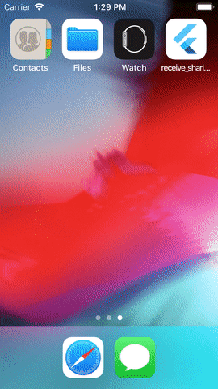

# receive_sharing_intent
[](https://pub.dev/packages/receive_sharing_intent)

A Flutter plugin that enables flutter apps to receive sharing photos, videos, text, urls or any other file types from another app.

Also, supports iOS Share extension and launching the host app automatically.
Check the provided [example](./example/lib/main.dart) for more info.


|             | Android                | iOS               |
|-------------|------------------------|-------------------|
| **Support** | SDK 21+ (Kotlin 2.4.0) | 13.0+ (Swift 5.0) |





# Usage

To use this plugin, add `receive_sharing_intent` as a [dependency in your pubspec.yaml file](https://flutter.io/platform-plugins/). For example:

```yaml
dependencies:
  receive_sharing_intent: ^latest
```

## Android

Add the following filters to your [android/app/src/main/AndroidManifest.xml](./example/android/app/src/main/AndroidManifest.xml):

```xml
<manifest xmlns:android="http://schemas.android.com/apk/res/android"
.....
 <uses-permission android:name="android.permission.READ_EXTERNAL_STORAGE"/>

  <application
        android:name="io.flutter.app.FlutterApplication"
        ...
        >
<!--Set activity launchMode to singleTask, if you want to prevent creating new activity instance everytime there is a new intent.-->
    <activity
            android:name=".MainActivity"
            android:launchMode="singleTask"
            android:theme="@style/LaunchTheme"
            android:configChanges="orientation|keyboardHidden|keyboard|screenSize|locale|layoutDirection|fontScale|screenLayout|density|uiMode"
            android:hardwareAccelerated="true"
            android:windowSoftInputMode="adjustResize">

            <!--TODO:  Add this filter, if you want support opening urls into your app-->
            <intent-filter>
               <action android:name="android.intent.action.VIEW" />
               <category android:name="android.intent.category.DEFAULT" />
               <category android:name="android.intent.category.BROWSABLE" />
               <data
                   android:scheme="https"
                   android:host="example.com"
                   android:pathPrefix="/invite"/>
            </intent-filter>

            <!--TODO:  Add this filter, if you want support opening files into your app-->
            <intent-filter>
              <action android:name="android.intent.action.VIEW" />
              <category android:name="android.intent.category.DEFAULT" />
              <data
                   android:mimeType="*/*"
                   android:scheme="content" />
            </intent-filter>

             <!--TODO: Add this filter, if you want to support sharing text into your app-->
            <intent-filter>
               <action android:name="android.intent.action.SEND" />
               <category android:name="android.intent.category.DEFAULT" />
               <data android:mimeType="text/*" />
            </intent-filter>

            <!--TODO: Add this filter, if you want to support sharing images into your app-->
            <intent-filter>
                <action android:name="android.intent.action.SEND" />
                <category android:name="android.intent.category.DEFAULT" />
                <data android:mimeType="image/*" />
            </intent-filter>

            <intent-filter>
                <action android:name="android.intent.action.SEND_MULTIPLE" />
                <category android:name="android.intent.category.DEFAULT" />
                <data android:mimeType="image/*" />
            </intent-filter>

             <!--TODO: Add this filter, if you want to support sharing videos into your app-->
            <intent-filter>
                <action android:name="android.intent.action.SEND" />
                <category android:name="android.intent.category.DEFAULT" />
                <data android:mimeType="video/*" />
            </intent-filter>
            <intent-filter>
                <action android:name="android.intent.action.SEND_MULTIPLE" />
                <category android:name="android.intent.category.DEFAULT" />
                <data android:mimeType="video/*" />
            </intent-filter>

            <!--TODO: Add this filter, if you want to support sharing any type of files-->
            <intent-filter>
                <action android:name="android.intent.action.SEND" />
                <category android:name="android.intent.category.DEFAULT" />
                <data android:mimeType="*/*" />
            </intent-filter>
            <intent-filter>
                <action android:name="android.intent.action.SEND_MULTIPLE" />
                <category android:name="android.intent.category.DEFAULT" />
                <data android:mimeType="*/*" />
            </intent-filter>
      </activity>

  </application>
</manifest>
....
```

## iOS

#### 1. Create Share Extension

- Using Xcode, go to File/New/Target and Choose "Share Extension".
- Give it a name, i.e., "Share Extension".

Make sure the deployment target for Runner.app and the share extension is the same.

#### 2. Replace your [ios/Share Extension/Info.plist](./example/ios/Share%20Extension/Info.plist) with the following:

```xml
<?xml version="1.0" encoding="UTF-8"?>
<!DOCTYPE plist PUBLIC "-//Apple//DTD PLIST 1.0//EN" "http://www.apple.com/DTDs/PropertyList-1.0.dtd">
<plist version="1.0">
  <dict>
    <key>AppGroupId</key>
    <string>$(CUSTOM_GROUP_ID)</string>
	<key>CFBundleVersion</key>
	<string>$(FLUTTER_BUILD_NUMBER)</string>
	<key>NSExtension</key>
	<dict>
		<key>NSExtensionAttributes</key>
        <dict>
            <key>PHSupportedMediaTypes</key>
               <array>
                    <!--TODO: Add this flag, if you want to support sharing video into your app-->
                   <string>Video</string>
                   <!--TODO: Add this flag, if you want to support sharing images into your app-->
                   <string>Image</string>
               </array>
            <key>NSExtensionActivationRule</key>
            <dict>
                <!--TODO: Add this flag, if you want to support sharing text into your app-->
                <key>NSExtensionActivationSupportsText</key>
                <true/>
                <!--TODO: Add this tag, if you want to support sharing urls into your app-->
            	<key>NSExtensionActivationSupportsWebURLWithMaxCount</key>
            	<integer>1</integer>
            	<!--TODO: Add this flag, if you want to support sharing images into your app-->
                <key>NSExtensionActivationSupportsImageWithMaxCount</key>
                <integer>100</integer>
                <!--TODO: Add this flag, if you want to support sharing video into your app-->
                <key>NSExtensionActivationSupportsMovieWithMaxCount</key>
                <integer>100</integer>
                <!--TODO: Add this flag, if you want to support sharing other files into your app-->
                <!--Change the integer to however many files you want to be able to share at a time-->
				<key>NSExtensionActivationSupportsFileWithMaxCount</key>
				<integer>1</integer>
            </dict>
        </dict>
		<key>NSExtensionMainStoryboard</key>
		<string>MainInterface</string>
		<key>NSExtensionPointIdentifier</key>
		<string>com.apple.share-services</string>
	</dict>
  </dict>
</plist>
```
#### 3. Add the following to your [ios/Runner/Info.plist](./example/ios/Runner/Info.plist):

```xml
...
<key>AppGroupId</key>
<string>$(CUSTOM_GROUP_ID)</string>
<key>CFBundleURLTypes</key>
	<array>
		<dict>
			<key>CFBundleTypeRole</key>
			<string>Editor</string>
			<key>CFBundleURLSchemes</key>
			<array>
				<string>ShareMedia-$(PRODUCT_BUNDLE_IDENTIFIER)</string>
			</array>
		</dict>
	</array>

<key>NSPhotoLibraryUsageDescription</key>
<string>To upload photos, please allow permission to access your photo library.</string>
...
```

#### 4. Add the following to your [ios/Runner/Runner.entitlements](./example/ios/Runner/Runner.entitlements):


```xml
....
    <!--TODO:  Add this tag, if you want support opening urls into your app-->
    <key>com.apple.developer.associated-domains</key>
    <array>
        <string>applinks:example.com</string>
    </array>
....
```


#### 5. Make the plugin available to the Share Extension (Swift Package Manager)

This plugin is distributed as a **Swift Package** (SPM only — there is no CocoaPods
podspec). Make sure Swift Package Manager is enabled for your project:

```sh
flutter config --enable-swift-package-manager
```

Flutter automatically adds the plugin to your **Runner** target. Your **Share
Extension** target also needs access to the `receive_sharing_intent` module
(it provides `RSIShareViewController`). Add it in Xcode:

* Select the **Share Extension** target → **General** tab.
* Under **Frameworks and Libraries**, click **+**.
* Choose the **`receive-sharing-intent`** library from the
  `receive_sharing_intent` Swift package and add it.

> If you previously used CocoaPods, remove the `ios/Podfile` and run
> `pod deintegrate` in the `ios/` directory, then remove the
> `#include "Pods/..."` lines from `ios/Flutter/Debug.xcconfig` and
> `ios/Flutter/Release.xcconfig`. See the
> [example project](./example/ios) for a fully SPM-only setup.

#### 6. Add Runner and Share Extension in the same group

* Go to `Signing & Capabilities` tab and add App Groups capability in **BOTH** Targets: `Runner` and `Share Extension` 
* Add a new container with the name of your choice. For example `group.MyContainer` in the example project its `group.com.kasem.ShareExtention`
* Add User-defined(`Build Settings -> +`) string `CUSTOM_GROUP_ID` in **BOTH** Targets: `Runner` and `Share Extension` and set value to group id created above. You can use different group ids depends on your flavor schemes

#### 7. Go to Build Phases of your Runner target and move `Embed Foundation Extension` to the top of `Thin Binary`. 


#### 8. Make your `ShareViewController`  [ios/Share Extension/ShareViewController.swift](./example/ios/Share%20Extension/ShareViewController.swift) inherit from `RSIShareViewController`:


```swift
// If you get no such module 'receive_sharing_intent' error.
// Go to Build Phases of your Runner target and
// move `Embed Foundation Extension` to the top of `Thin Binary`.
import receive_sharing_intent

class ShareViewController: RSIShareViewController {
      
    // Use this method to return false if you don't want to redirect to host app automatically.
    // Default is true
    override func shouldAutoRedirect() -> Bool {
        return false
    }
    
}
```

```xml
<key>NSExtensionPrincipalClass</key>
<string>$(PRODUCT_MODULE_NAME).ShareViewController</string>
```

The example's **Action Extension** ("Share to RSI") demonstrates this direct-open
mode; the **Share Extension** demonstrates the compose-dialog mode.

##### Auto-redirect vs. the built-in compose UI

`RSIShareViewController` is a plain `UIViewController` (it no longer subclasses
the deprecated `SLComposeServiceViewController`). Its behaviour depends on
`shouldAutoRedirect()`:

* **`true` (default)** — no UI is shown. The shared content is processed and the
  extension immediately redirects into your host app. There is no white compose
  card and no dimmed system sheet behind it.
* **`false`** — a built-in compose sheet is shown: a bottom card with a circular
  close button, a "Send" button, an auto-focused message field (the keyboard
  comes up automatically), and a thumbnail preview of the first shared item.
  Tapping the dimmed background cancels the share.

You can customise the built-in compose UI by overriding these `open` members:

```swift
class ShareViewController: RSIShareViewController {

    override func shouldAutoRedirect() -> Bool { false }

    // Placeholder shown in the empty message field.
    override var placeholder: String { "Add a caption…" }

    // Title of the confirm button (can be a long label).
    override var sendButtonTitle: String { "Send to Example" }

    // Gate the Send button on your own validation. Default: always valid.
    override func isContentValid() -> Bool { !contentText.isEmpty }

    // Called when the user taps Send. Default saves the message and redirects.
    override func didSelectPost() { saveAndRedirect(message: contentText) }

    // Called when the user taps Cancel / taps the dimmed background.
    // Default cancels the extension request.
    override func didSelectCancel() { cancel() }
}
```

The typed message is available via `contentText` and is forwarded to your Flutter
app as a shared text item.

> **Migration note:** the compose UI previously came from the system
> `SLComposeServiceViewController`. That API is deprecated, so the plugin now
> ships its own equivalent UI (implemented in `RSIComposeView`). The
> `contentText`, `isContentValid()` and `didSelectPost()` hooks are preserved.
> The old `navigationTitle` and `characterLimit` overrides were removed.

#### 9. Adopt `UISceneDelegate` (required for upcoming iOS versions)

Newer iOS versions deliver lifecycle events (including shared URLs) through a
`UISceneDelegate` instead of the `AppDelegate`. This plugin already adopts the
scene lifecycle (it conforms to `FlutterSceneLifeCycleDelegate` and registers
itself with `addSceneDelegate`), so it keeps working automatically once your app
adopts a scene delegate. Follow Flutter's official
[UISceneDelegate migration guide](https://docs.flutter.dev/release/breaking-changes/uiscenedelegate),
summarized below.

b. Add a `SceneDelegate` that subclasses `FlutterSceneDelegate` (see
[example/ios/Runner/SceneDelegate.swift](./example/ios/Runner/SceneDelegate.swift)).
For a typical app this can be empty — the plugin handles the shared URLs itself.
Only override `scene(_:openURLContexts:)` if your app uses multiple libraries
that handle incoming URLs and you need to disambiguate between them:

```swift
import Flutter
import UIKit
import receive_sharing_intent

class SceneDelegate: FlutterSceneDelegate {
    // Optional - only needed when multiple libraries handle incoming URLs.
    // Called on a cold start when the scene connects. The shared URL (if any)
    // is delivered here via connectionOptions instead of the launchOptions.
    override func scene(
        _ scene: UIScene,
        willConnectTo session: UISceneSession,
        options connectionOptions: UIScene.ConnectionOptions
    ) {
        // Work-around to prevent other libraries like flutter_branch_sdk from absorbing links meant to be handled by receive_sharing_intent.
        _ = ReceiveSharingIntentPlugin.instance.scene(scene, willConnectTo: session, options: connectionOptions)
        super.scene(scene, willConnectTo: session, options: connectionOptions)
    }

    // Called while the app is already running (warm start).
    override func scene(_ scene: UIScene, openURLContexts URLContexts: Set<UIOpenURLContext>) {
        // Work-around to prevent other libraries like flutter_branch_sdk from absorbing links meant to be handled by receive_sharing_intent.
        if ReceiveSharingIntentPlugin.instance.scene(scene, openURLContexts: URLContexts) {
            return
        }
        // Proceed url handling for other Flutter libraries like uni_links
        super.scene(scene, openURLContexts: URLContexts)
    }
}
```

> This plugin is distributed via Swift Package Manager only, so make sure SPM is
> enabled (`flutter config --enable-swift-package-manager`).

#### Compiling issues and their fixes

* Error: No such module 'receive_sharing_intent' (in the Share Extension)
  * Fix: Add the `receive-sharing-intent` library to the Share Extension target under
    **General → Frameworks and Libraries** (see step 5).

* Error: Unable to resolve module dependency: 'receive_sharing_intent'
  * Fix: Ensure Swift Package Manager is enabled and the Share Extension target links the
    `receive-sharing-intent` Swift package product (see step 5).

* Error: Invalid Bundle. The bundle at 'Runner.app/Plugins/Sharing Extension.appex' contains disallowed file 'Frameworks'
    * Fix: https://stackoverflow.com/a/25789145/2061365


## Full Example

[main.dart](./example/lib/main.dart)

```dart
import 'package:flutter/material.dart';
import 'dart:async';

import 'package:receive_sharing_intent/receive_sharing_intent.dart';

void main() => runApp(MyApp());

class MyApp extends StatefulWidget {
  @override
  _MyAppState createState() => _MyAppState();
}

class _MyAppState extends State<MyApp> {
  late StreamSubscription _intentSub;
  final _sharedFiles = <SharedMediaFile>[];

  @override
  void initState() {
    super.initState();

    // Listen to media sharing coming from outside the app while the app is in the memory.
    _intentSub = ReceiveSharingIntent.instance.getMediaStream().listen((value) {
      setState(() {
        _sharedFiles.clear();
        _sharedFiles.addAll(value);

        print(_sharedFiles.map((f) => f.toMap()));
      });
    }, onError: (err) {
      print("getIntentDataStream error: $err");
    });

    // Get the media sharing coming from outside the app while the app is closed.
    ReceiveSharingIntent.instance.getInitialMedia().then((value) {
      setState(() {
        _sharedFiles.clear();
        _sharedFiles.addAll(value);
        print(_sharedFiles.map((f) => f.toMap()));

        // Tell the library that we are done processing the intent.
        ReceiveSharingIntent.instance.reset();
      });
    });
  }

  @override
  void dispose() {
    _intentSub.cancel();
    super.dispose();
  }

  @override
  Widget build(BuildContext context) {
    const textStyleBold = const TextStyle(fontWeight: FontWeight.bold);
    return MaterialApp(
      home: Scaffold(
        appBar: AppBar(
          title: const Text('Plugin example app'),
        ),
        body: Center(
          child: Column(
            children: <Widget>[
              Text("Shared files:", style: textStyleBold),
              Text(_sharedFiles
                      .map((f) => f.toMap())
                      .join(",\n****************\n")),
            ],
          ),
        ),
      ),
    );
  }
}
```

